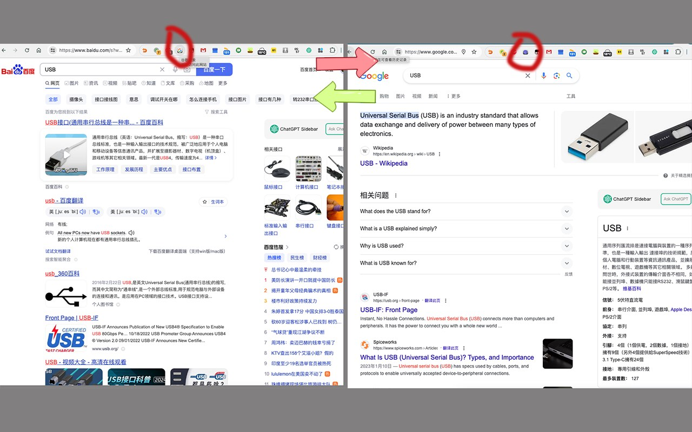

# easy_switch

一个浏览器扩展。网站间的快速切换，保留搜索内容继续搜索。可以通过按钮或者快捷键切换。支持自定义搜索网站。
移植自Chrome同名扩展，原扩展已下架([备份地址](https://www.crx4chrome.com/extensions/fknieppmhfgnjilnkdeoegocjkijpbfh/))。
由于原作者常年未维护，也无法联系。若有侵权，请联系我删除。

## 下载地址

[Chrome 商店](https://chrome.google.com/webstore/detail/pchjdhcdlgghofamcpncdlhdonbeaplk)
，[Firefox Addon](https://addons.mozilla.org/zh-CN/firefox/addon/easy_switch)
，[Edge商店](https://microsoftedge.microsoft.com/addons/detail/jijkhdficgnnikdijnkienfnmfbolmpb)

> 由于本人不用Edge，所以不保证Edge版本可以正常工作，仅保持和另外两个版本代码一致。

## 后续计划

1. 移植到safari

## 更新日志

见[Changelog](CHANGELOG.md)。